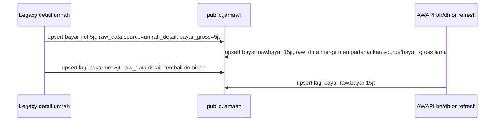

# Investigasi `jamaah.bayar` Flapping

Tanggal investigasi: 2026-05-24 WIB.
Scope fase 1: baca kode, `SELECT` read-only Supabase, dan satu percobaan HTTP GET read-only ke AWAPI yang gagal network. Tidak ada `UPDATE` / `INSERT` / `DELETE` / `UPSERT` / `ALTER` yang dijalankan ke production.

## Ringkasan Eksekutif

Root cause terkonfirmasi: ada lebih dari satu writer kolom `jamaah.bayar` pada conflict key yang sama `(agent_id,id_umroh,jm_id)`.

1. Writer legacy detail `umrah_detail` menghitung `bayar` net:
   `bayar = harga_paket - diskon_kantor - diskon_marketing - sisa_paket`, sambil menyimpan `raw_data.bayar_gross = harga_paket - sisa_paket`.
2. Writer AWAPI menulis `bayar` dari payload resmi `raw.bayar`, lalu `preserveLegacyUmrohRawData()` menggabungkan raw lama dan raw baru. Akibatnya `raw_data.source='umrah_detail'` dan `raw_data.bayar_gross` lama bisa tetap ada, sementara kolom `bayar` sudah ditimpa nilai AWAPI.
3. Karena kedua writer memakai `upsert(..., { onConflict: 'agent_id,id_umroh,jm_id' })`, sync berikutnya bisa bergantian menulis nilai net legacy detail dan nilai AWAPI/list ke baris logis yang sama. Ini menjelaskan flapping 5jt <-> 15jt pada SITI KOMARIAH.

Pola `bayar < bayar_gross` bukan bug yang sama. Query snapshot menunjukkan 1.329/1.329 baris lower mismatch persis sama dengan `bayar_gross - diskon_kantor - diskon_marketing`. Itu transform gross -> net yang eksplisit di kode.

## Snapshot DB Read-Only

Snapshot saat query saya berbeda sedikit dari audit awal karena data sedang berubah:

- Total baris saat query: 3.656.
- Baris dengan `raw_data.bayar_gross`: 2.609.
- `bayar <> raw_data.bayar_gross`: 1.333.
- `bayar < raw_data.bayar_gross`: 1.329.
- `bayar > raw_data.bayar_gross`: 4 saat query ini.
- `raw_data.source`: `umrah_detail` 2.609, `NULL` 1.047.

Klasifikasi raw source:

| Kombinasi raw | Count | Arti |
|---|---:|---|
| `source=NULL`, `sync_endpoint=dh`, ada `raw_data.bayar`, tanpa `bayar_gross` | 861 | Baris AWAPI pendaftaran murni |
| `source=NULL`, `sync_endpoint=bh`, ada `raw_data.bayar`, tanpa `bayar_gross` | 186 | Baris AWAPI keberangkatan murni |
| `source=umrah_detail`, `sync_endpoint=NULL`, tanpa `raw_data.bayar`, ada `bayar_gross` | 2.598 | Baris legacy detail murni |
| `source=umrah_detail`, `sync_endpoint=dh`, ada `raw_data.bayar`, ada `bayar_gross` | 11 | Baris campuran legacy detail + AWAPI; ini kelas yang bisa membuat `bayar` dan `bayar_gross` tidak sejalan |

Snapshot SITI KOMARIAH saat query sudah kembali ke nilai detail:

- `id_umroh=AIW0028864`, `jm_id=JM999999990000062962`, agent `indowisata`.
- `bayar=5.000.000`, `sisa=23.900.000`, `paket=HEMAT Quard`.
- `raw_data.source='umrah_detail'`, `raw_data.bayar_gross=5.000.000`, `harga_paket=28.900.000`, `status_bayar='CICILAN'`.
- `capi_purchase_status='dp'`, `capi_last_bayar=0`.

Ini konsisten dengan gejala flapping: audit sebelumnya menangkap state 15jt, query saya menangkap state berikutnya setelah writer detail mengembalikan 5jt.

Empat anomali `bayar > bayar_gross` yang masih ada saat query semuanya baris agent `dewi`, booking `AIW0026379`, `paket=UHUD`:

| JM ID | Nama | bayar | bayar_gross | raw_data.bayar | sync_endpoint |
|---|---|---:|---:|---:|---|
| `JM999999990000056152` | EDHI JULIANTORO | 40.900.000 | 39.900.000 | 40.900.000 | `dh` |
| `JM999999990000056153` | LINDA RAHAYU | 40.900.000 | 39.900.000 | 40.900.000 | `dh` |
| `JM999999990000056154` | GIOVINAZZI FABIAN ALIDI | 40.900.000 | 39.900.000 | 40.900.000 | `dh` |
| `JM999999990000056155` | QOTRUNNADA KEOLA ALIDI | 40.900.000 | 39.900.000 | 40.900.000 | `dh` |

Pada keempat baris itu, `raw_data.bayar` dari AWAPI sama dengan kolom `bayar`, sementara `raw_data.bayar_gross` masih berasal dari legacy `umrah_detail`. Ini bukti langsung mekanisme campuran raw lama + writer AWAPI.

## Semua Write Path yang Menyentuh `jamaah.bayar`

### 1. AWAPI full sync manual/background

Lokasi:

- [awapi-client.js:303](/Users/bagas/alhijaz/awapi-client.js:303): `normalizeAwapiRow()`.
- [server.js:5794](/Users/bagas/alhijaz/server.js:5794): `syncUmrahViaApiCore()`.
- [server.js:5895](/Users/bagas/alhijaz/server.js:5895): `supabase.from('jamaah').upsert(batch, { onConflict: 'agent_id,id_umroh,jm_id' })`.
- Manual trigger: [server.js:6169](/Users/bagas/alhijaz/server.js:6169) `POST /api/laporan/sync`, jika `AWAPI_SYNC_ENABLED === 'true'`.
- Background trigger: [server.js:14550](/Users/bagas/alhijaz/server.js:14550) `syncOneAgent()`, loop dimulai [server.js:15448](/Users/bagas/alhijaz/server.js:15448) 30 detik setelah boot, cooldown 10 menit saat AWAPI aktif.

Sumber data:

- `/awapi/gu/{code}/bh/{tahunHijriah}` via `awapiFetchUmrahByKeberangkatan()`.
- `/awapi/gu/{code}/dh/{tahunHijriah}` via `awapiFetchUmrahByPendaftaran()`.

Transform:

- `bayar: safeBigint(raw.bayar)`.
- `sisa: safeBigint(raw.bayar_sisa)`.
- `raw_data: raw`.

Raw data:

- Menulis `raw_data` dengan payload AWAPI + `sync_source`/`sync_endpoint`.
- Sebelum upsert, [server.js:5873](/Users/bagas/alhijaz/server.js:5873) memanggil `preserveLegacyUmrohRawDataForRows()`.
- Di [awapi-client.js:341](/Users/bagas/alhijaz/awapi-client.js:341), `preserveLegacyUmrohRawData()` merge `{ ...existingRaw, ...incomingRaw }`. Karena AWAPI tidak punya `bayar_gross/source`, raw lama `source='umrah_detail'` dan `bayar_gross` bisa tetap ada.

Efek:

- Writer ini dapat menimpa `jamaah.bayar` dengan `raw.bayar` dari AWAPI/list, tanpa menjadikan `raw_data.bayar_gross` sebagai sumber kebenaran.
- Ini kandidat utama penyebab nilai 15jt masuk saat detail masih menunjukkan gross 5jt.

### 2. AWAPI single jamaah refresh

Lokasi:

- [server.js:6720](/Users/bagas/alhijaz/server.js:6720): `GET /api/laporan/jamaah/:idJamaah/refresh`.
- [server.js:6739](/Users/bagas/alhijaz/server.js:6739): fetch `/awapi/gu/{code}/jamaah/{IDJamaah}`.
- [server.js:6759](/Users/bagas/alhijaz/server.js:6759): upsert `rowForUpsert`, conflict `agent_id,id_umroh,jm_id`.

Transform dan raw data:

- Sama seperti `normalizeAwapiRow()`: `bayar = raw.bayar`, `sisa = raw.bayar_sisa`, `raw_data = raw`.
- Juga memanggil `preserveLegacyUmrohRawDataForRows()` dan `preserveSuspiciousAwapiRefreshPayments()`.

Efek:

- Bisa menimpa baris yang sama dengan nilai AWAPI single-jamaah.
- Guard hanya menangani kasus `bayar > 0 && sisa < 0` di [awapi-client.js:420](/Users/bagas/alhijaz/awapi-client.js:420). SITI 15jt/13,9jt masih `sisa >= 0`, jadi tidak tertahan guard.

### 3. AWAPI single umrah refresh

Lokasi:

- [server.js:6784](/Users/bagas/alhijaz/server.js:6784): `GET /api/laporan/umrah/:idUmrah/refresh`.
- [server.js:6803](/Users/bagas/alhijaz/server.js:6803): fetch `/awapi/gu/{code}/umrah/{IDUmrah}`.
- [server.js:6830](/Users/bagas/alhijaz/server.js:6830): upsert `safeRows`, conflict `agent_id,id_umroh,jm_id`.

Transform dan raw data:

- Sama seperti path AWAPI full sync.

Efek:

- Bisa menimpa semua jamaah dalam booking dengan `raw.bayar` dari AWAPI.

### 4. Legacy manual Phase 1 detail

Lokasi:

- Parser: [laporan-api.js:552](/Users/bagas/alhijaz/laporan-api.js:552) `fetchUmrahDetail()`.
- Formula: [laporan-api.js:620](/Users/bagas/alhijaz/laporan-api.js:620) sampai [laporan-api.js:653](/Users/bagas/alhijaz/laporan-api.js:653).
- Caller: [server.js:6239](/Users/bagas/alhijaz/server.js:6239) Phase 1 manual sync.
- Upsert: [server.js:6382](/Users/bagas/alhijaz/server.js:6382), conflict `agent_id,id_umroh,jm_id`.

Sumber data:

- Legacy HTML `route=umrah&act=edit&id={idUmroh}`.
- Kolom detail: harga paket, diskon kantor, diskon marketing, sisa paket, status bayar.

Transform:

- `hargaPaket = parseRupiah(col[4])`.
- `diskonKantor = parseRupiah(col[5])`.
- `diskonMarketing = parseRupiah(col[6])`.
- `sisaPaket = parseRupiah(col[7])`.
- `bayar = hargaPaket - diskonKantor - diskonMarketing - sisaPaket`.
- `raw_data.bayar_gross = Math.max(0, hargaPaket - sisaPaket)`.
- `raw_data.source = 'umrah_detail'`.

Raw data:

- Menulis raw detail, termasuk `source='umrah_detail'`, `harga_paket`, `diskon_*`, `bayar_gross`.
- Sebelum upsert manual Phase 1 memanggil `preserveLegacyUmrohRawDataForRows()`, tapi incoming raw detail tetap membawa `source/bayar_gross`.

Efek:

- Ini writer yang mengembalikan SITI ke 5jt.
- Ini juga menjelaskan semua lower mismatch sebagai net payment.

### 5. Legacy manual Phase 2 laporan

Lokasi:

- Parser: [laporan-api.js:686](/Users/bagas/alhijaz/laporan-api.js:686) `parseLaporanHtml()`.
- Formula: [laporan-api.js:771](/Users/bagas/alhijaz/laporan-api.js:771) sampai [laporan-api.js:775](/Users/bagas/alhijaz/laporan-api.js:775).
- Caller: [server.js:6473](/Users/bagas/alhijaz/server.js:6473) manual Phase 2, jika tidak didefer.
- Upsert: [server.js:6663](/Users/bagas/alhijaz/server.js:6663), conflict `agent_id,id_umroh,jm_id`.

Sumber data:

- Legacy laporan HTML `_claporanm.php`, kolom `BAYAR PAKET` dan `SISA PAKET`.

Transform:

- `bayar = parseRupiah(col[33])`.
- `sisa = parseRupiah(col[34])`.
- Tidak menghitung gross/net dari harga dan diskon.

Raw data:

- Menulis `raw_data: { jm_id, jm_id_hint, cols_count }`, bukan `source='umrah_detail'` dan bukan `bayar_gross`.

Guard:

- [server.js:6634](/Users/bagas/alhijaz/server.js:6634) `shouldKeepExistingBayar(existingPayment,row.bayar)` mencegah regressi dari existing yang lebih tinggi, kecuali existing adalah legacy gross lama.

Efek:

- Jika inline Phase 2 aktif, path ini juga dapat menimpa `bayar` tanpa raw payment yang sepadan.
- Namun saat `AWAPI_SYNC_ENABLED` dan agent punya `awapi_key`, [server.js:6465](/Users/bagas/alhijaz/server.js:6465) men-defer Phase 2 inline ke scheduled enrichment.

### 6. Legacy background Phase 1 detail

Lokasi:

- Caller: [server.js:14610](/Users/bagas/alhijaz/server.js:14610).
- Parser sama: `fetchUmrahDetail()`.
- Row build: [server.js:14670](/Users/bagas/alhijaz/server.js:14670) sampai [server.js:14685](/Users/bagas/alhijaz/server.js:14685).
- Upsert: [server.js:14750](/Users/bagas/alhijaz/server.js:14750), conflict `agent_id,id_umroh,jm_id`.

Sumber/transform/raw data:

- Sama dengan legacy detail: net `bayar`, `raw_data.source='umrah_detail'`, `raw_data.bayar_gross`.

Efek:

- Jika AWAPI full sync gagal dan fallback legacy berjalan, path ini bisa menulis ulang `bayar` ke nilai net/detail.

### 7. Legacy background Phase 2 laporan

Lokasi:

- Caller: [server.js:14803](/Users/bagas/alhijaz/server.js:14803), jika tidak didefer.
- Parser sama: `parseLaporanHtml()`.
- Upsert: [server.js:14939](/Users/bagas/alhijaz/server.js:14939), conflict `agent_id,id_umroh,jm_id`.

Sumber/transform/raw data:

- Sama dengan manual Phase 2 laporan: `bayar = col[33]`, `sisa = col[34]`, raw minimal tanpa `bayar_gross`.

Efek:

- Bisa menulis `bayar` dari laporan tanpa raw payment detail yang sepadan.
- Saat AWAPI aktif, [server.js:14795](/Users/bagas/alhijaz/server.js:14795) men-defer inline Phase 2.

### 8. Diagnostic script manual

Lokasi:

- [scripts/test-perlengkapan-upsert.js:31](/Users/bagas/alhijaz/scripts/test-perlengkapan-upsert.js:31).

Sumber/transform/raw data:

- Memakai `awapiFetchUmrahById()` + `normalizeAwapiRow()`, lalu upsert conflict `agent_id,id_umroh,jm_id`.

Efek:

- Bukan cron/endpoint production, tapi tetap writer `bayar` jika script dijalankan manual. Jangan dipakai ke production tanpa isolasi.

## Write Path yang Tidak Menyentuh `bayar`

- Scheduled Umroh Phase 2 enrichment pada [server.js:15164](/Users/bagas/alhijaz/server.js:15164) hanya memanggil `enrichJamaahFromLaporanItems()`; fungsi itu membuat patch `wa/tgl_lahir/no_paspor/paspor_expired/tgl_daftar/perlengkapan/dokumen` di [server.js:5386](/Users/bagas/alhijaz/server.js:5386) dan update di [server.js:5413](/Users/bagas/alhijaz/server.js:5413). Tidak ada `bayar` di patch.
- Note endpoint [server.js:8880](/Users/bagas/alhijaz/server.js:8880) hanya update `notes/notes_updated_at`.
- CAPI claim/rollback [server.js:4458](/Users/bagas/alhijaz/server.js:4458) hanya update `capi_purchase_status`.
- `capi_last_bayar` tidak dibaca oleh runtime sync saat ini; hanya muncul di migration/backfill lama.

## Urutan yang Menyebabkan Flapping

Tidak ada ordering guard berbasis `synced_at` atau sumber data. Semua path memakai last-write-wins pada conflict key yang sama.

## Asal Angka 15jt untuk SITI

Yang terkonfirmasi dari kode:

- SITI saat state detail memiliki `harga_paket=28.900.000`, `sisa=23.900.000`, sehingga legacy detail menghitung `bayar=5.000.000` dan `bayar_gross=5.000.000`.
- Satu-satunya path yang dapat menulis angka berbeda sambil tetap mempertahankan `raw_data.bayar_gross` lama adalah AWAPI path:
  - `normalizeAwapiRow()` mengambil `bayar` langsung dari `raw.bayar` di [awapi-client.js:319](/Users/bagas/alhijaz/awapi-client.js:319).
  - `preserveLegacyUmrohRawData()` mempertahankan raw lama di [awapi-client.js:341](/Users/bagas/alhijaz/awapi-client.js:341).
  - `syncUmrahViaApiCore()` mengambil endpoint list `bh`/`dh` di [server.js:5817](/Users/bagas/alhijaz/server.js:5817) sampai [server.js:5833](/Users/bagas/alhijaz/server.js:5833), lalu upsert di [server.js:5895](/Users/bagas/alhijaz/server.js:5895).

Yang tidak berhasil dikonfirmasi langsung:

- Percobaan GET read-only ke `/awapi/gu/{code}/jamaah/JM999999990000062962` dan `/awapi/gu/{code}/umrah/AIW0028864` dari workspace gagal network (`AwapiError: Network error: fetch failed`). Jadi payload live 15jt untuk SITI tidak berhasil saya ambil.

Bukti pengganti dari DB:

- Empat anomali aktif saat query memiliki pola campuran yang sama dan lebih eksplisit: `raw_data.bayar` dari AWAPI `dh` sama dengan kolom `bayar`, sementara `raw_data.bayar_gross` legacy lebih rendah. Ini mengonfirmasi mekanisme yang dapat menghasilkan state SITI 15jt/5jt.

## Konfirmasi Pola -500rb / Lower Mismatch

Kode:

- [laporan-api.js:622](/Users/bagas/alhijaz/laporan-api.js:622) menyatakan diskon kantor/marketing mengurangi jumlah yang benar-benar dibayar.
- [laporan-api.js:629](/Users/bagas/alhijaz/laporan-api.js:629) menghitung `bayar bersih = harga - diskon - sisa`.
- [laporan-api.js:651](/Users/bagas/alhijaz/laporan-api.js:651) menyimpan `bayar_gross = harga_paket - sisa_paket`.

Query:

- Semua 1.329 baris lower mismatch memenuhi:
  `bayar = raw_data.bayar_gross - diskon_kantor - diskon_marketing`.
- Tidak ada lower mismatch yang melanggar formula itu pada snapshot query.

Kesimpulan: lower mismatch adalah transform net yang disengaja oleh kode saat ini. Jangan dikoreksi massal sebelum product/finance mengonfirmasi definisi final gross vs net.

## Idempotensi dan CAPI

Idempotensi pembayaran belum aman:

- Semua writer utama memakai conflict target yang sama `agent_id,id_umroh,jm_id`.
- Tidak ada source priority, version check, atau guard agar `bayar` hanya ditulis oleh satu canonical source.
- `preserveLegacyUmrohRawData()` membuat raw data campuran, sehingga `bayar` bisa berasal dari AWAPI sementara `bayar_gross/source` berasal dari legacy detail.

CAPI:

- Runtime CAPI menggunakan `capi_purchase_status` sebagai dedup state: null -> `dp` -> `lunas` di [server.js:4425](/Users/bagas/alhijaz/server.js:4425).
- DP hanya dikirim jika `bayar > 0`, `sisa > 0`, dan status masih `null` di [server.js:4555](/Users/bagas/alhijaz/server.js:4555).
- Lunas dikirim jika `sisa <= 0` dan status belum `lunas` di [server.js:4548](/Users/bagas/alhijaz/server.js:4548).
- Untuk SITI saat query, `capi_purchase_status='dp'`; flapping 5jt <-> 15jt dengan `sisa > 0` tidak akan mengirim DP berulang.
- `capi_last_bayar` tidak dipakai runtime; tidak menjadi dedup aktif.

Risiko tersisa: jika salah satu writer membuat `sisa <= 0` secara keliru, CAPI bisa mengklaim `lunas` sekali. Itu bukan laporan gejala SITI saat ini, tapi tetap risiko dari writer pembayaran yang tidak canonical.

## Rekomendasi Perbaikan Minimal dan Aman

1. Tetapkan canonical writer untuk `jamaah.bayar`.
   Pilihan paling aman dari bukti saat ini: legacy `umrah_detail` karena ia menulis `bayar`, `sisa`, `diskon_*`, `harga_paket`, `bayar_gross`, dan `source` dalam satu raw snapshot yang konsisten.

2. AWAPI full sync dan refresh tetap boleh mengisi field non-payment, tetapi jangan overwrite `bayar`, `sisa`, `diskon_kantor`, `diskon_marketing`, atau raw payment detail jika existing row punya `raw_data.source='umrah_detail'`.

3. Jika AWAPI harus tetap menjadi canonical di masa depan, maka `raw_data.bayar_gross` harus ikut diganti dengan field yang sesuai AWAPI atau dibuang dari raw campuran. Jangan ada state `bayar` AWAPI berdampingan dengan `bayar_gross` legacy.

4. Legacy laporan Phase 2 (`parseLaporanHtml`) sebaiknya tidak menulis `bayar` lagi; jadikan enrichment-only seperti scheduled Phase 2, kecuali ada bukti bisnis bahwa kolom `BAYAR PAKET` laporan adalah canonical.

5. Tambahkan test guard:
   - AWAPI normalization/upsert tidak boleh overwrite payment saat existing row punya `source='umrah_detail'`.
   - Legacy detail lower mismatch tetap mengikuti formula net.
   - Scheduled enrichment tetap tidak menyentuh payment.

6. Siapkan SQL koreksi terpisah untuk anomali `bayar > raw_data.bayar_gross` setelah patch disetujui. Untuk 1.329 lower mismatch, jangan koreksi.

## Checkpoint

Fase 1 selesai. Stop di sini sesuai instruksi. Fase 2 belum dikerjakan dan belum ada kode sync yang diubah.

---

## Update 2026-06-05 — Guard `sisa < 0` salah klasifikasi booking multi-pax LUNAS (bug reminder pelunasan palsu)

Catatan di atas ("Guard hanya menangani kasus `bayar > 0 && sisa < 0`") kini perlu dikoreksi: kondisi itu **bukan selalu anomali**. Investigasi 2026-06-05 (laporan agent yenita, jamaah AHMAD SULAIMI `AIW0028647` lunas 2 Juni tapi tetap ditagih reminder pelunasan tiap hari) menemukan:

1. **Pola normal AWAPI untuk booking multi-pax lunas**: endpoint list (`dh`/`bh`) melaporkan `bayar` di level BOOKING (agregat seluruh pax, mis. 104,7jt = 3 × 34,9jt) sementara `paket_harga`/`bayar_sisa` per-pax → `bayar_sisa` negatif + `bayar_status="LEBIH BAYAR"`. Itu **sinyal lunas**, bukan payload korup.
2. Guard `preserveExistingPaymentForSuspiciousAwapiRow` membekukan `bayar`/`sisa` lama selamanya untuk row seperti ini (AWAPI selamanya kirim sisa negatif → guard re-trigger tiap sync). Blast radius saat investigasi: 1.766 row / 722 booking / 25 agent ber-`payment_guard`; 24 row stuck `sisa > 0`; 4 row aktif memicu reminder palsu (yenita `AIW0028647`, nikita `AIW0028945`).
3. **Bug sekunder**: guard meng-embed seluruh `raw_data` lama ke `awapi_refresh_snapshot` tiap kali jalan → nesting rekursif (max 255 level); 1.766 row guarded memegang 9,6MB dari 11MB total `raw_data` jamaah.

### Fix yang di-deploy (A+B+E)

- **A (mitigasi)** — `telegram-notifier.js` `pelunasanReminder`: select alias `raw_data->>bayar_status` / `raw_data->>bayar_sisa`, skip row yang upstream-nya lapor LUNAS/LEBIH BAYAR atau `bayar_sisa < 0` (`isUpstreamLunas`).
- **B (root fix)** — `awapi-client.js` `resolveAggregateBookingLunasRow`, dipanggil di `preserveSuspiciousAwapiPayments` SEBELUM guard: jika row suspicious DAN status LUNAS/LEBIH BAYAR DAN `paket_harga > 0` DAN `bayar % paket_harga === 0` → normalisasi `bayar = paket_harga` (GROSS — AWAPI tidak pernah mengurangkan diskon dari `bayar`; terverifikasi 251/251 row LUNAS ber-diskon punya `bayar == paket_harga`), `sisa = 0`, tag `raw_data.payment_normalized`. Payload genuinely-invalid (`paket_harga <= 0`, rasio non-integer) tetap di-guard.
- **E (anti-bloat)** — `stripPaymentGuardBookkeeping`: keys bookkeeping guard tidak pernah ikut di-embed ke snapshot baru → nesting berhenti di 1 level. Catatan: bloat historis pada row yang business-state-nya tidak berubah TIDAK menyusut otomatis (`raw_data` masuk `VOLATILE_JAMAAH_KEYS`, row di-skip partition) — sisanya ~2,4MB, perlu backfill terpisah jika mau direklamasi.

Keputusan canonical-source di rekomendasi Fase 1 di atas tetap relevan untuk kelas flapping legacy-vs-AWAPI; resolver ini hanya menangani sub-kelas agregat-booking-lunas yang sebelumnya salah dianggap anomali.
