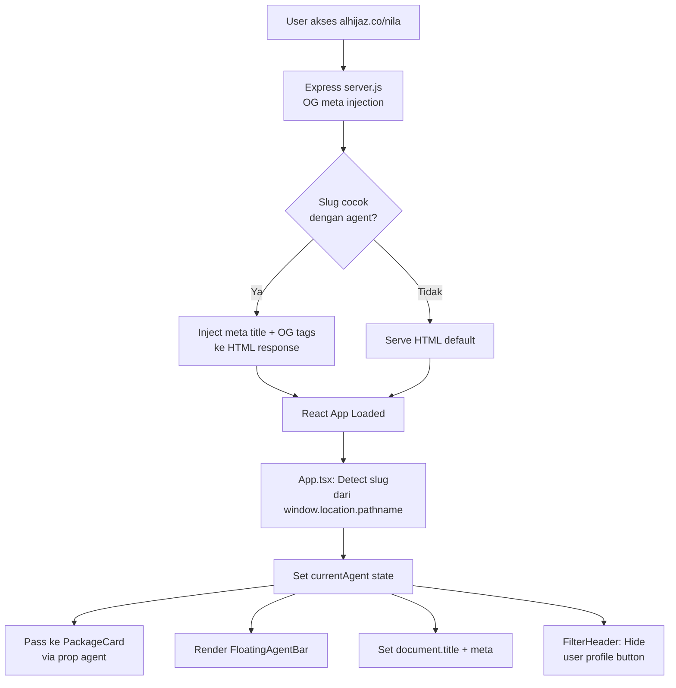

# Custom Slug Profil Agent — Dokumentasi Teknis

## Gambaran Umum

Fitur ini memungkinkan setiap agent memiliki URL khusus (slug) yang menampilkan profil mereka di seluruh halaman. Ketika user mengakses `alhijaz.co/nila`, website akan menampilkan informasi agent "Nila" di setiap card paket dan floating bar di bawah layar.

---

## Arsitektur



---

## File Terlibat

| File | Fungsi |
|---|---|
| [agents.ts](file:///Users/bagas/alhijaz/src/data/agents.ts) | Database agent (Supabase + fallback) |
| [AgentProfile.tsx](file:///Users/bagas/alhijaz/src/components/AgentProfile.tsx) | Komponen profil di dalam card |
| [FloatingAgentBar.tsx](file:///Users/bagas/alhijaz/src/components/FloatingAgentBar.tsx) | Floating bar di bawah layar |
| [App.tsx](file:///Users/bagas/alhijaz/src/App.tsx) | Deteksi slug, state `currentAgent`, SEO dinamis |
| [FilterHeader.tsx](file:///Users/bagas/alhijaz/src/components/FilterHeader.tsx) | Sembunyikan tombol profil user di agent mode |
| [PackageCard.tsx](file:///Users/bagas/alhijaz/src/components/PackageCard.tsx) | Render `AgentProfile`, exclude dari screenshot |
| [server.js](file:///Users/bagas/alhijaz/server.js) | Server-side OG meta injection + CAPI API |

---

## Data Agent

**Lokasi:** `src/data/agents.ts`

```typescript
export interface AgentData {
  name: string;      // Nama lengkap
  website: string;   // Domain website (tanpa https://)
  phone: string;     // Nomor WA format 628xxx (tanpa +)
  photo: string;     // Path foto di /public/agents/
}

export const AGENTS_DATA: Record<string, AgentData> = {
  'nila': {          // ← slug = key = bagian URL
    name: 'Nila Novita Sari',
    website: 'alhijaztourtravels.com',
    phone: '6285211209049',
    photo: '/agents/nila.jpg',
  },
};
```

> [!IMPORTANT]
> Data agent disimpan di **Supabase** (tabel `agents`). File `agents.ts` memiliki fallback hardcoded jika Supabase tidak tersedia.

---

## Komponen UI

### 1. AgentProfile (di dalam card)

- **Posisi:** Di antara section Manasik dan Extra Hotels
- **Style:** Gradient `from-emerald-50 via-white to-white`, border `border-emerald-100`
- **Icon:** Logo WhatsApp (inline SVG), bukan Lucide
- **Tombol:** "Chat" hijau (`bg-emerald-500`), rounded-full
- **Pesan WA:** `Assalamualaikum, Saya mau tanya terkait paket [Nama Paket]` (dinamis per card)
- **Screenshot:** Di-exclude via `data-html2canvas-ignore`
- **Dark mode:** ✅ Fully supported

### 2. FloatingAgentBar (floating bottom bar)

- **Posisi:** `fixed bottom-6 left-4 right-4 z-50`, `rounded-full`
- **Style:** Gradient sama dengan AgentProfile, `backdrop-blur-md`, `shadow-2xl`
- **Layout:** Foto + nama (kiri) | Tombol Chat (kanan)
- **Pesan WA:** Umum — `Assalamualaikum, Saya mau tanya paket umroh di Alhijaz`
- **Smart scroll:** Hide saat scroll down, show saat scroll up
- **Dark mode:** ✅ Fully supported

---

## Logika Deteksi Slug

**Lokasi:** `App.tsx` (terpusat, bukan per-card)

```typescript
const slug = window.location.pathname.replace(/^\/+/, '').split('/')[0];
const agent = AGENTS_DATA[slug?.toLowerCase()];
```

| URL | Slug | Agent Found? | Efek |
|---|---|---|---|
| `alhijaz.co/` | `""` | ❌ | Tampilan standar |
| `alhijaz.co/nila` | `nila` | ✅ | Agent mode aktif |
| `alhijaz.co/xyz` | `xyz` | ❌ | Tampilan standar |

---

## Perilaku Agent Mode

| Komponen | Root (`/`) | Agent (`/nila`) |
|---|---|---|
| AgentProfile di card | ❌ Hidden | ✅ Tampil |
| FloatingAgentBar | ❌ Hidden | ✅ Tampil |
| Tombol Profil User (header) | ✅ Tampil | ❌ Hidden |
| Document Title | Default | `Jadwal Umroh Alhijaz \| Nila Novita Sari` |
| Meta Description | Default | Dinamis dengan nama agent |
| OG Tags (link preview) | Default | Dinamis (via middleware) |
| Screenshot (html2canvas) | — | AgentProfile **di-exclude** |

---

## SEO & Link Preview

### Client-side (App.tsx)
- `document.title` dan `<meta description>` di-set via `useEffect`
- Berfungsi untuk user yang sudah membuka halaman

### Server-side (server.js)
- Express `server.js` mengubah HTML sebelum dikirim ke client/crawler
- Inject `<title>`, `<meta description>`, dan OG tags
- Data agent diambil dari Supabase (dengan in-memory cache)
- **Wajib** untuk link preview di WhatsApp, Facebook, Twitter

---

## Cara Menambah Agent Baru

1. **Tambah entry** di Supabase Dashboard → tabel `agents`
2. **Taruh foto** di `public/agents/[slug].jpg`
3. **Deploy:** `git add . && git commit -m "Add agent [name]" && git push`

---

## Foto Agent

- **Lokasi:** `public/agents/`
- **Format:** JPG, ukuran kecil (< 100KB recommended)
- **Fallback:** Jika foto tidak ada, otomatis generate avatar via `ui-avatars.com`
