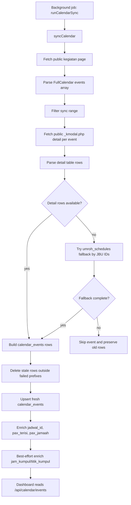

# Calendar Public Scraping Design

## Goal

Switch Dashboard calendar sync for manasik, keberangkatan, and kepulangan from the authenticated legacy staff system to the public Alhijaz kegiatan calendar page while preserving the current Dashboard behavior and data contract.

Target public source:

`https://alhijazindowisata.com/jadwal/kegiatan/alhijaz-indowisata`

## Current Behavior

The Dashboard calendar UI does not scrape directly. It reads grouped rows from the local `calendar_events` table through `/api/calendar/events`.

The background sync currently lives in `calendar-api.js` and does these steps:

1. Logs in to the legacy staff system at `115.124.86.220/aiw/staff` with `CALENDAR_USERNAME`, `CALENDAR_PASSWORD`, and `CALENDAR_KANTOR`.
2. Fetches the legacy FullCalendar page.
3. Parses the inline `events: [...]` array.
4. Fetches each event detail modal from `pages/_jmodal.php`.
5. Parses detail tables into `calendar_events` rows.
6. Enriches rows with `jadwal_id`, `pax_terisi`, `pax_jamaah`, and optional kumpul data.

The fragile part is steps 1-4 because they depend on legacy login credentials and the authenticated staff route. The stable part is the local `calendar_events` contract and the enrichment/UI flow after rows are produced.

## Public Source Findings

The public page already contains the same FullCalendar event list inline. At inspection time it returned 123 events:

- 28 manasik
- 50 keberangkatan
- 45 kepulangan

Each event has the same shape needed by the existing parser:

```json
{
  "title": "Keberangkatan UMROH",
  "start": "2026-07-05",
  "extendedProps": {
    "mjudul": "KEBERANGKATAN UMROH",
    "aid": "B1532",
    "icon": "plane-departure",
    "apalah": "JBU1532"
  }
}
```

The public page loads event details with this unauthenticated modal endpoint:

`https://alhijazindowisata.com/jadwal/_kmodal.php?.m=<aid>&.g=<JBU ids>`

The modal HTML has the same functional fields as the current Dashboard needs:

- `GROUP`
- `PESAWAT`
- `WAKTU`
- `PAKET`
- `PAX`
- `STAFF` for keberangkatan and kepulangan
- `TL`

For manasik, the modal omits `STAFF` and includes a visible departure-date prefix inside the `PAKET` cell. That matches the existing Dashboard convention where manasik package names may be stored as `DD/MM/YYYY<package name>`.

## Recommended Approach

Use the public page plus its public modal endpoint as the primary calendar source.

This is the safest option because it removes authenticated legacy access while preserving 1:1 detail fidelity. The main public page alone contains event dates and JBU IDs, but the modal contains group number, flight, time, package display name, pax, staff, and tour leader. Deriving those fields only from `umroh_schedules` would be less accurate and could drop information that the Dashboard already shows.

The sync should still keep the existing fallback from `umroh_schedules` for event details that are empty or temporarily unavailable. Fallback must remain conservative: use it only when all referenced JBU IDs can be resolved, otherwise keep older rows for that event instead of writing placeholders.

## Architecture

Keep the external contract unchanged:

- `calendar_events` table shape remains unchanged.
- `/api/calendar/events` response shape remains unchanged.
- `UpcomingSchedule`, `CalendarInsight`, flight status, AI insight, MCP calendar tools, and Telegram reminders continue to consume `calendar_events`.

Change only the ingestion side of `calendar-api.js`:

1. Replace legacy login/page fetch with a public page fetch.
2. Parse the public page's FullCalendar `events` array into the existing internal event shape:
   - `date`
   - `type`
   - `title`
   - `aid`
   - `apalah`
   - `raw`
3. Replace legacy detail fetch with public `_kmodal.php` fetch.
4. Parse public modal tables with the existing header-based parser, adjusted to treat `WAKTU` as the same semantic field currently stored as `jam`.
5. Preserve the existing range filter, stale-delete behavior, fallback behavior, enrichment, and return payload.

This keeps the blast radius low: Dashboard readers remain unchanged, and only the scraper source is swapped.

## Components

### `calendar-api.js`

Responsibilities after the change:

- Define public source constants:
  - `CALENDAR_PUBLIC_PAGE_URL`
  - `CALENDAR_PUBLIC_MODAL_BASE_URL`
- Fetch the public kegiatan page with a normal browser-like `User-Agent`.
- Extract and validate the inline FullCalendar event array.
- Fetch each public detail modal with `aid` and `apalah`.
- Parse modal rows into the existing row detail shape.
- Keep `syncCalendar`, `enrichCalendarPaxJamaah`, and `enrichKeberangkatanWithKumpul` behavior intact.

Legacy-specific responsibilities to remove from the calendar sync path:

- `loginInternal`
- cookie/session handling for calendar sync
- `cek_login.php`
- `pages/main.php?route=home`
- `pages/_jmodal.php`
- calendar use of `CALENDAR_USERNAME`, `CALENDAR_PASSWORD`, `CALENDAR_KANTOR`, and `INTERNAL_API_BASE`

`buildCookieString` and `isSessionExpiredHtml` can remain available to other modules, but `calendar-api.js` should stop importing them unless another calendar path still needs them.

### `lib/calendar-schedule-fallback.js`

Keep this module. It remains useful when a public modal returns an empty table or temporary incomplete detail. It already builds detail rows from resolved JBU IDs and `umroh_schedules`.

### `lib/calendar-jadwal-match.js`

Keep this module unchanged unless tests reveal public modal package text needs normalization. It still maps `calendar_events` rows to `umroh_schedules` for `jadwal_id`, `pax_terisi`, and `pax_jamaah`.

### `server.js`

No endpoint contract change. The only server behavior change should be operational text around alerting if desired. Calendar failure alerts should mention the public kegiatan page or modal endpoint instead of legacy credentials.

## Data Flow



## Parsing Rules

### Event Type

Reuse the existing `detectEventType` behavior:

- title containing `keberangkatan` or `berangkat` -> `keberangkatan`
- title containing `kepulangan` or `pulang` -> `kepulangan`
- otherwise -> `manasik`

Skip events whose `start` is absent or `0000-00-00`.

### Event Detail Table

Parse by table header text, not fixed column position.

Field mapping:

- `GROUP` -> `group_number`
- `PESAWAT` -> `pesawat`
- `JAM` or `WAKTU` -> `jam`
- `PAKET` -> `paket`
- `PAX` -> `pax`
- `STAFF` -> `staff`
- `TL` -> `tour_leader`

For missing optional columns:

- `staff` defaults to `-`
- `tour_leader` defaults to `-`

For manasik modal rows, the `PAKET` cell includes a child date span such as `30 Juni 2026` followed by the package name. Store this as the existing manasik display convention: `DD/MM/YYYY<package name>`, so `UpcomingSchedule.parsePaket` and `matchEventToSchedule` continue to work.

If the modal uses `WAKTU` as the header, store it in `jam` without changing downstream field names.

## Error Handling

The sync must fail loudly when the public page cannot be parsed:

- HTTP failure on main page -> sync failure
- missing `events` array -> sync failure
- JSON parse failure -> sync failure
- zero valid events -> sync failure

Per-event modal failures should remain partial:

- record the event prefix in `failedEventKeys`
- skip writing new rows for that event
- preserve existing rows for that event during stale-delete
- continue processing other events

Empty detail tables should follow the current safe behavior:

- try `buildScheduleFallbackDetails`
- if fallback is complete, write fallback rows
- if fallback is incomplete, preserve existing event rows and continue

The retry and ops alert chain in `server.js` should continue to work. Alert copy should be updated so operators check the public page/modal endpoint rather than login credentials.

## Security And Configuration

The calendar sync must no longer depend on secrets or credentials:

- no calendar login
- no calendar cookie
- no calendar use of `CALENDAR_USERNAME`
- no calendar use of `CALENDAR_PASSWORD`
- no calendar use of `CALENDAR_KANTOR`
- no calendar use of `INTERNAL_API_BASE`

Other legacy integrations in the repo can keep their credentials if they are unrelated to the Dashboard calendar.

The public source URL may be configurable with a non-secret env var for emergency override, but it should have a safe default and should not require `.env` for normal operation.

## Testing

Add focused tests before implementation:

1. Public event parser extracts FullCalendar events from a fixture that resembles the public page.
2. Public modal parser maps `WAKTU` to `jam`.
3. Public modal parser handles manasik rows with a visible Indonesian departure-date prefix and stores `DD/MM/YYYY<package>`.
4. Calendar sync source code no longer contains calendar login calls or `CALENDAR_PASSWORD`.
5. Existing fallback and matching tests keep passing:
   - `tests/calendar-api-fallback.test.js`
   - `tests/calendar-jadwal-match.test.js`

Manual verification after implementation:

1. Run the calendar parser against the live public page and confirm event counts are non-zero and close to the observed source count.
2. Run a small detail fetch sample for one manasik, one keberangkatan, and one kepulangan event.
3. Run targeted node tests.
4. If a server/session is available, trigger the sync in a local or staging environment and open `http://localhost:5173/dashboard`.
5. Confirm calendar dots, bottom-sheet details, pax display, AI insight, and flight-related views still render.

## Rollout

Keep the `calendar_events` table and Dashboard API stable, so rollback is simple: revert only the scraper-source change in `calendar-api.js` if the public source changes unexpectedly.

Do not delete unrelated legacy env vars or unrelated legacy integrations in the same implementation. This change is scoped to Dashboard calendar ingestion only.

## Out Of Scope

- Redesigning Dashboard calendar UI.
- Changing the `calendar_events` schema.
- Changing agent jamaah sync, AWAPI sync, or haji sync.
- Removing all legacy access from the entire application.
- Reworking AI insight prompt behavior.
